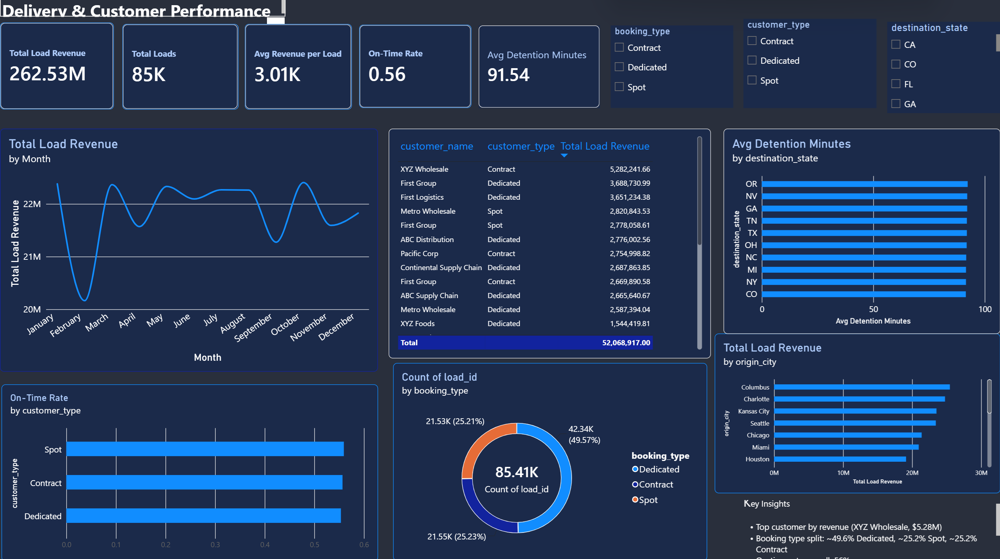
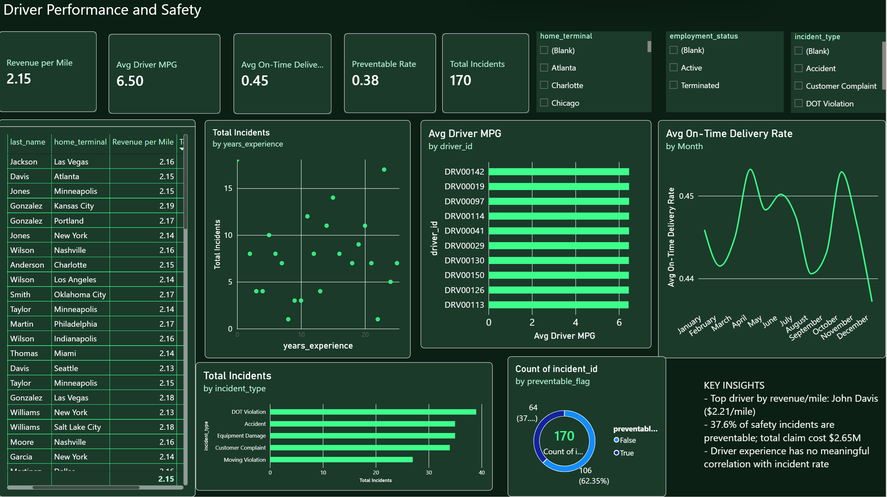

# Logistics Operations Analytics — Capstone Project

A 3-page Power BI dashboard suite analyzing a 14-table logistics operations database, covering fleet maintenance, delivery performance, and driver safety.

Built as the capstone project for a 4-month Data Analytics course at **TS Academy**.

---

## 📋 Project Brief

The dataset was intentionally open-ended — no fixed instructions, no required chart list. The brief:

> Explore and understand the dataset. Analyze it using any tool of your choice. Create a dashboard based on your insights. Creativity, structure, and insight matter.

**Dataset:** Logistics Operations Database — 14 relational tables covering customers, trucks, trailers, drivers, facilities, routes, loads, trips, fuel purchases, maintenance records, delivery events, safety incidents, and two pre-aggregated monthly metrics tables (driver and truck level).

**Tool used:** Power BI (data modeling, DAX, interactive report pages)

---

## 🗂️ Data Model

Built a relational model connecting 11 of the 14 tables across three report pages, rather than flattening everything into one table. Key relationships:

```
customers ──┐
routes ─────┼─→ loads ──→ trips ──┬─→ fuel_purchases
            │                     ├─→ delivery_events
drivers ────┼─────────────────────┤
trucks ─────┼─────────────────────┼─→ safety_incidents
trailers ───┘
maintenance_records ──→ trucks
driver_monthly_metrics (agg) ──→ drivers
truck_utilization_metrics (agg) ──→ trucks
```

---

## 📊 Dashboard Pages

### 01 — Fleet & Maintenance Efficiency


**Key insights:**
- Atlanta has the highest maintenance cost per mile among all terminals; Denver has the lowest
- Fleet composition: 76.67% Active, 12.5% in Maintenance, 10.83% Inactive
- One truck (~11 years old) shows a downtime outlier of ~40K hours, nearly 4x the fleet norm — flagged as a candidate for retirement or deeper inspection
- Monthly maintenance cost shows no steady trend, swinging between ~270K and ~430K with a sharp November peak

### 02 — Delivery & Customer Performance


**Key insights:**
- Top customer by revenue: XYZ Wholesale ($5.28M)
- Booking type is nearly evenly split: ~49.6% Dedicated, ~25.2% Spot, ~25.2% Contract
- On-time delivery rate sits at 56% overall
- Detention time is remarkably uniform across destination states (~91–92 min everywhere) — suggesting delays are driven by operations, not location
- Revenue dipped sharply in February before recovering — a seasonal pattern worth tracking

### 03 — Driver Performance & Safety


**Key insights:**
- Top driver by revenue per mile: John Davis ($2.21/mile)
- 37.6% of safety incidents are flagged preventable, totaling $2.65M in claims
- DOT Violations are the most common incident type, closely followed by Equipment Damage and Accidents
- Years of driving experience shows almost no correlation with incident count — experience alone doesn't predict safety outcomes

---

## 🧮 Sample DAX Measures

```DAX
Maintenance Cost per Mile =
DIVIDE([Total Maintenance Cost], [Total Miles])

On-Time Rate =
DIVIDE([On-Time Deliveries], [Total Deliveries])

Preventable Rate =
DIVIDE([Preventable Incidents], [Total Incidents])

Revenue per Mile =
DIVIDE([Total Driver Revenue], [Total Driver Miles])
```

---

## 🛠️ Skills Demonstrated

- Relational data modeling across multiple fact/dimension tables
- DAX measure writing (aggregations, ratios, conditional calculations)
- Interactive report design (slicers, cross-filtering, Top N filtering)
- Dashboard UX/theming (consistent color systems across report pages)
- Data-driven storytelling — deriving and stating findings directly from the model, not assumptions

---

## 📁 Repo Contents

```
├── README.md
├── screenshots/
│   ├── 01-fleet-maintenance.png
│   ├── 02-delivery-customer.png
│   └── 03-driver-safety.png
└── Akali_Divine_Chijindum_capstone.pbix
```

---

## 👤 Author

**Akali Divine Chijindum**
Data Analytics — TS Academy
🔗 [linkedin.com/in/akali-divine-chijindum](https://linkedin.com/in/akali-divine-chijindum)

Capstone project completed under the mentorship of **Ezekiel Aleke**.
